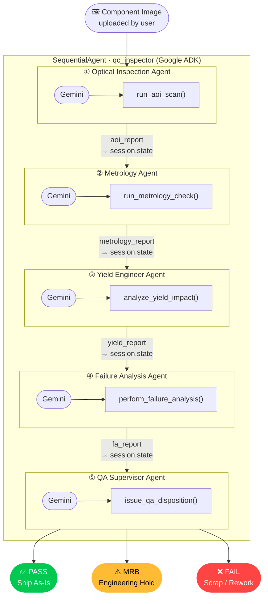

# Agentic QC Inspector

A multi-agent AI application for manufacturing quality control, built with **Google ADK** (Agent Development Kit) and **Gemini**. Upload a component image and a pipeline of five specialist agents inspects it in sequence, producing a structured report and a final **PASS / FAIL / MRB** disposition.

---

## Overview

The pipeline mirrors a real manufacturing QA floor, with each agent playing a distinct industrial role:

| # | Agent | Factory Role |
|---|-------|-------------|
| 1 | Optical Inspection Agent | AOI (Automated Optical Inspection) Machine |
| 2 | Metrology Agent | CMM / Dimensional Verification Station |
| 3 | Yield Engineer Agent | Process & Yield Analysis Engineer |
| 4 | Failure Analysis Agent | FA Lab Engineer |
| 5 | QA Supervisor Agent | Final Release Authority |

Each agent calls its own validated tool to record findings. Results flow downstream — every agent reads the output of all agents before it, so the QA supervisor has full context when issuing the verdict.

---

## Architecture



Each agent writes its structured output to ADK session state via `output_key`. Downstream agents read upstream context via `{key}` template injection in their instructions — so every agent sees the full picture built by its predecessors.

---

## Tech Stack

| Layer | Technology |
|-------|-----------|
| AI Framework | [Google ADK](https://google.github.io/adk-docs/) |
| Language Model | Gemini (configurable via `GEMINI_MODEL`) |
| UI | [Streamlit](https://streamlit.io) |
| Image handling | [Pillow](https://pillow.readthedocs.io) |
| Testing | pytest + pytest-asyncio |

---

## Quick Start

### 1. Clone and install

```bash
git clone https://github.com/kuanhoong/adk-multi-agent-demo.git
cd adk-multi-agent-demo
pip install -r requirements.txt
```

### 2. Configure API credentials

Create a `.env` file in the project root:

```env
GOOGLE_API_KEY=your_google_api_key_here
GEMINI_MODEL=gemini-2.5-flash
```

Get a key at [Google AI Studio](https://aistudio.google.com).

### 3. Run the Streamlit app

```bash
streamlit run app.py
```

Then open `http://localhost:8501` in your browser, upload a component image, and click **▶ Run Analysis**.

### 4. (Optional) Run via ADK web interface

```bash
adk web
```

---

## Project Structure

```
adk-multi-agent-demo/
├── agent.py              # All 5 LlmAgents + SequentialAgent root_agent
├── tools.py              # 5 validated tool functions (one per agent)
├── runner.py             # ADK Runner integration + async pipeline
├── app.py                # Streamlit UI
├── __init__.py           # Exports root_agent for `adk web`
├── generate_samples.py   # Generates synthetic test images (run once)
├── requirements.txt
├── pytest.ini
└── tests/
    ├── conftest.py
    ├── test_t01_scaffold.py     # File presence & imports
    ├── test_t02_tools.py        # Tool validation & schema
    ├── test_t03_fixtures.py     # Fixture schema
    ├── test_t04_optical_agent.py
    ├── test_t05_metrology_agent.py
    ├── test_t06_yield_agent.py
    ├── test_t07_fa_agent.py
    ├── test_t08_qa_agent.py
    ├── test_t09_root_agent.py   # Pipeline wiring
    ├── test_t10_ui_layout.py    # Pure UI functions
    ├── test_t11_runner.py       # Runner utilities
    ├── test_t12_display.py      # Display formatting
    └── test_t13_integration.py  # Cross-module integration
```

---

## Sample Test Images

Generate five synthetic component images to test the pipeline:

```bash
python generate_samples.py
```

| Image | Component | Expected Verdict |
|-------|-----------|-----------------|
| `ic_chip_clean.jpg` | IC-7430-MCU, no defects | PASS |
| `ic_chip_cracked.jpg` | IC chip with hairline crack | MRB |
| `pcb_solder_defect.jpg` | PCB with solder bridge | FAIL |
| `capacitor_clean.jpg` | SMD 0402 capacitor array | PASS |
| `bga_misaligned.jpg` | BGA with 2 misaligned balls | MRB / FAIL |

---

## Running Tests

```bash
pytest
```

261 tests across 13 test files. No real API calls are made during testing — all agent config and runner tests use mocks or structural assertions only.

---

## Disposition Reference

| Verdict | Meaning |
|---------|---------|
| **PASS** | Component meets all quality standards — ship as-is |
| **FAIL** | Fails standards — scrap or rework required, do not ship |
| **MRB** | Material Review Board hold — borderline, engineering review required |

---

## License

MIT
